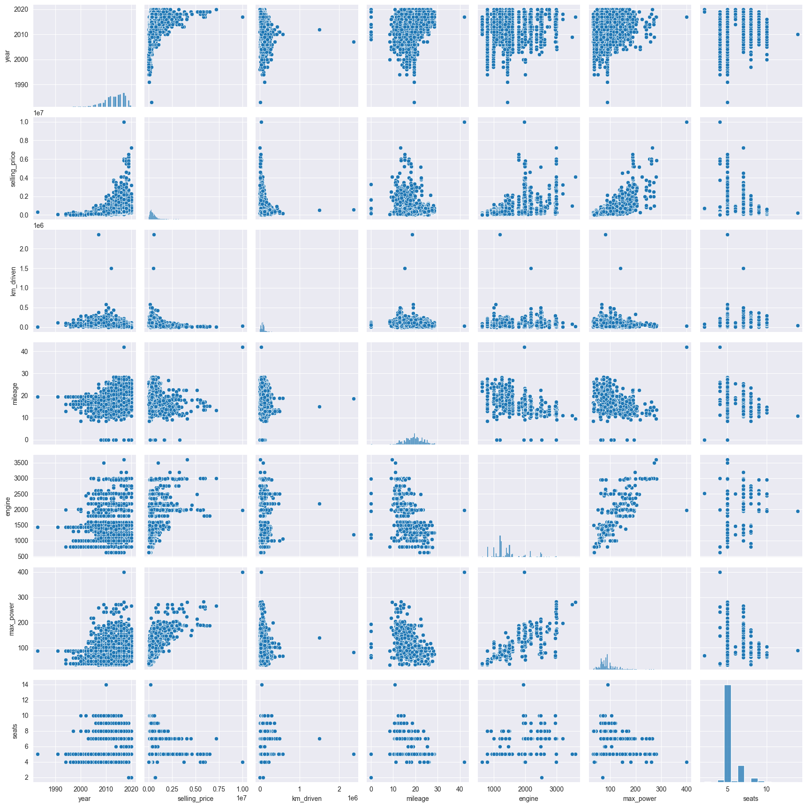
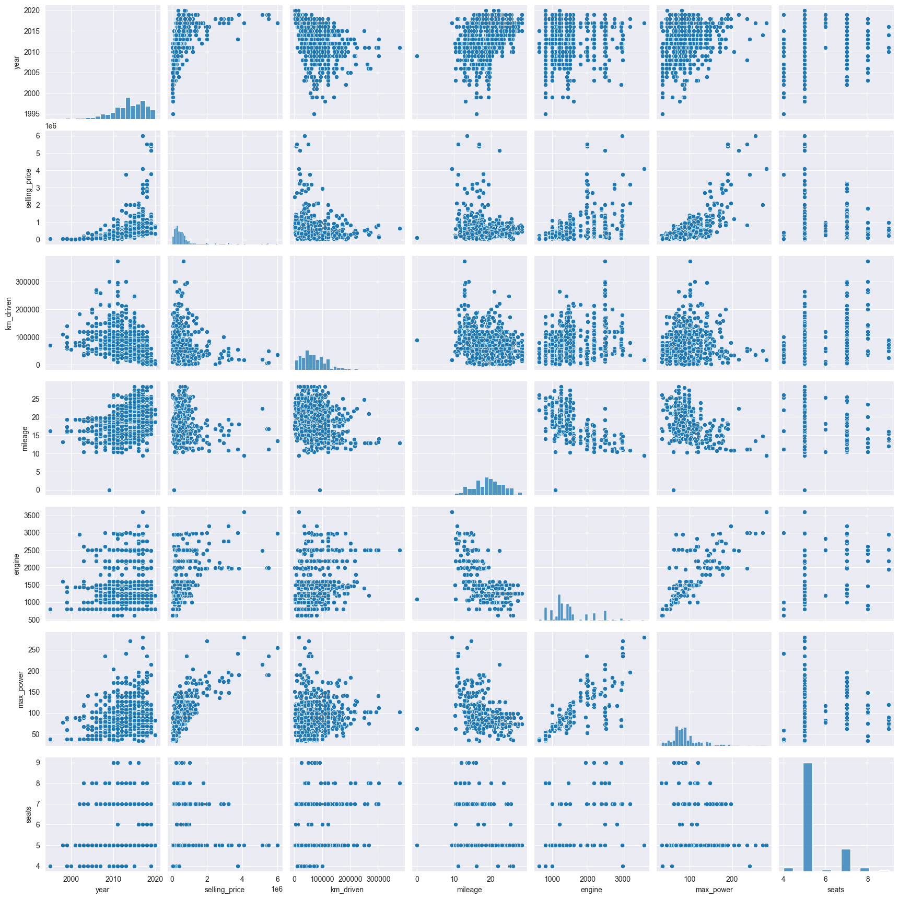
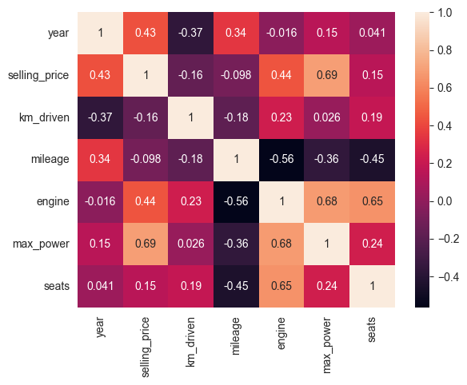
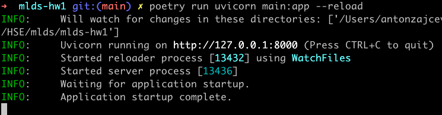
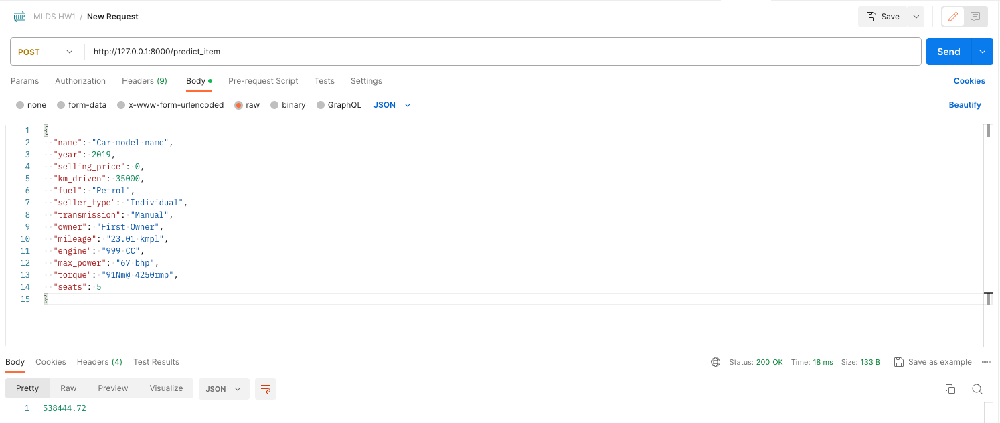
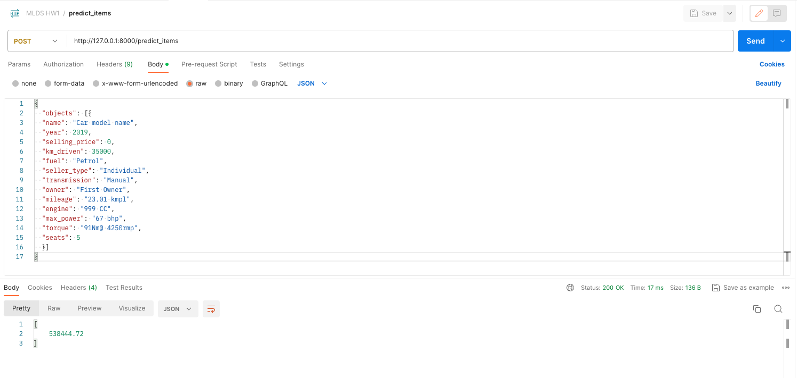
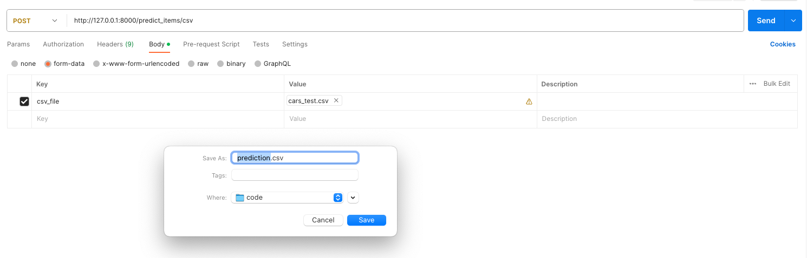

# Машинное обучение - Домашнее задание № 1
## Описание
В этом задании была обучена модель регрессии для предсказания стоимости автомобилей, а также реализован веб-сервис для применения построенной модели на новых данных.

### Структура проекта
- [ноутбук со всеми проведенными экспериментами](HW1_Regression_with_inference.ipynb)
- [файл FastAPI сервиса](main.py)
- [.pickle файл c сохраненными весами модели, коэффициентами скейлинга и прочими данными для инференса](inference_objects.pickle)
- [.md файл с выводами по проделанной работе](README.md)

## Часть 1 | Разведочный анализ данных
- [тренировочный датасет](https://raw.githubusercontent.com/hse-mlds/ml/main/hometasks/HT1/cars_train.csv)
- [тестовый датасет](https://raw.githubusercontent.com/hse-mlds/ml/main/hometasks/HT1/cars_test.csv)

*Таблица 1. Случайные 10 значений тренировочного датасета*

<table>
  <thead>
    <tr style="text-align: right;">
      <th></th>
      <th>name</th>
      <th>year</th>
      <th>selling_price</th>
      <th>km_driven</th>
      <th>fuel</th>
      <th>seller_type</th>
      <th>transmission</th>
      <th>owner</th>
      <th>mileage</th>
      <th>engine</th>
      <th>max_power</th>
      <th>torque</th>
      <th>seats</th>
    </tr>
  </thead>
  <tbody>
    <tr>
      <th>6565</th>
      <td>Renault KWID Climber 1.0 MT BSIV</td>
      <td>2019</td>
      <td>300000</td>
      <td>35000</td>
      <td>Petrol</td>
      <td>Individual</td>
      <td>Manual</td>
      <td>First Owner</td>
      <td>23.01 kmpl</td>
      <td>999 CC</td>
      <td>67 bhp</td>
      <td>91Nm@ 4250rpm</td>
      <td>5.0</td>
    </tr>
    <tr>
      <th>2943</th>
      <td>Maruti Wagon R LXI</td>
      <td>2013</td>
      <td>225000</td>
      <td>58343</td>
      <td>Petrol</td>
      <td>Trustmark Dealer</td>
      <td>Manual</td>
      <td>First Owner</td>
      <td>21.79 kmpl</td>
      <td>998 CC</td>
      <td>67.05 bhp</td>
      <td>90Nm@ 3500rpm</td>
      <td>5.0</td>
    </tr>
    <tr>
      <th>2024</th>
      <td>Hyundai i20 Asta 1.2</td>
      <td>2013</td>
      <td>360000</td>
      <td>30000</td>
      <td>Petrol</td>
      <td>Individual</td>
      <td>Manual</td>
      <td>First Owner</td>
      <td>18.5 kmpl</td>
      <td>1197 CC</td>
      <td>82.85 bhp</td>
      <td>113.7Nm@ 4000rpm</td>
      <td>5.0</td>
    </tr>
    <tr>
      <th>263</th>
      <td>Hyundai i20 1.2 Asta</td>
      <td>2010</td>
      <td>300000</td>
      <td>70000</td>
      <td>Petrol</td>
      <td>Individual</td>
      <td>Manual</td>
      <td>First Owner</td>
      <td>17.0 kmpl</td>
      <td>1197 CC</td>
      <td>80 bhp</td>
      <td>11.4 kgm at 4,000 rpm</td>
      <td>5.0</td>
    </tr>
    <tr>
      <th>4586</th>
      <td>Skoda Octavia L and K 1.9 TDI MT</td>
      <td>2005</td>
      <td>250000</td>
      <td>120000</td>
      <td>Diesel</td>
      <td>Individual</td>
      <td>Manual</td>
      <td>Third Owner</td>
      <td>16.4 kmpl</td>
      <td>1896 CC</td>
      <td>90 bhp</td>
      <td>21.4@ 1,900(kgm@ rpm)</td>
      <td>5.0</td>
    </tr>
    <tr>
      <th>4479</th>
      <td>Maruti Ciaz ZXi</td>
      <td>2016</td>
      <td>700000</td>
      <td>20000</td>
      <td>Petrol</td>
      <td>Individual</td>
      <td>Manual</td>
      <td>First Owner</td>
      <td>20.73 kmpl</td>
      <td>1373 CC</td>
      <td>91.1 bhp</td>
      <td>130Nm@ 4000rpm</td>
      <td>5.0</td>
    </tr>
    <tr>
      <th>4881</th>
      <td>Hyundai Grand i10 1.2 Kappa Magna BSIV</td>
      <td>2017</td>
      <td>445000</td>
      <td>27000</td>
      <td>Petrol</td>
      <td>Individual</td>
      <td>Manual</td>
      <td>First Owner</td>
      <td>18.9 kmpl</td>
      <td>1197 CC</td>
      <td>81.86 bhp</td>
      <td>113.75nm@ 4000rpm</td>
      <td>5.0</td>
    </tr>
    <tr>
      <th>3583</th>
      <td>Ford Ecosport 1.5 DV5 MT Trend</td>
      <td>2016</td>
      <td>515000</td>
      <td>68609</td>
      <td>Diesel</td>
      <td>Dealer</td>
      <td>Manual</td>
      <td>First Owner</td>
      <td>22.7 kmpl</td>
      <td>1498 CC</td>
      <td>89.84 bhp</td>
      <td>204Nm@ 2000-2750rpm</td>
      <td>5.0</td>
    </tr>
    <tr>
      <th>6361</th>
      <td>Hyundai Verna 1.4 VTVT</td>
      <td>2014</td>
      <td>500000</td>
      <td>33400</td>
      <td>Petrol</td>
      <td>Individual</td>
      <td>Manual</td>
      <td>First Owner</td>
      <td>17.43 kmpl</td>
      <td>1396 CC</td>
      <td>105.5 bhp</td>
      <td>135.3Nm@ 5000rpm</td>
      <td>5.0</td>
    </tr>
    <tr>
      <th>4108</th>
      <td>Hyundai i20 Era 1.2</td>
      <td>2015</td>
      <td>490000</td>
      <td>45900</td>
      <td>Petrol</td>
      <td>Individual</td>
      <td>Manual</td>
      <td>Second Owner</td>
      <td>18.6 kmpl</td>
      <td>1197 CC</td>
      <td>81.83 bhp</td>
      <td>114.7Nm@ 4000rpm</td>
      <td>5.0</td>
    </tr>
  </tbody>
</table>

Датасет содержит четыре числовых признака и девять строковых. 

Числовые признаки: 
- `sellgin_price` - целевой признак
- `year` - год выпуска
- `km_driven` - пробег
- `seats` количество мест

Строковые признаки:
- `name` - название модели
- `fuel` - тип топлива (4 категории)
- `seller_type` - тип продавца (3 категории)
- `transmission` - тип коробки передач (2 категории)
- `owner`- тип владельца (5 категорий)
- `mileage` - пробег на единицу топлива (числовое значение с единицами измерения)
- `engine` - объем двигателя (числовое значение с единицами измерения)
- `max_power` - максимальная мощность двигателя (числовое значение с единицами измерения)
- `torque` - максимальный крутящий момент и оборот двигателя (два значения с единицами измерения)

### Подготовка данных
- Найдены 1799 строк с одинаковым признаковым описанием. Дубликаты были удалены. В случае, если целевой признак дубликатов отличался, оставлялась первая запись в таблице
- Признаки `mileage`, `engine`, `max_power` были преобразованы к типу `float`
- Столбцы `name` и `torque` были удалены. В этом решении они не будут использоваться.
- Пропуски в столбцах были заполнены медианными значениями

### Визуализация данных
Изучим как распределены признаки и насколько они скоррелированы между собой и с целевой переменной. А также сравним рапределение тренировочных и тестовых данных.

*Диаграмма 1. Попарные отношения в тренировочном наборе данных*

**Связь предикторов с целевой переменной**

- возможно, квадратичная связь между `year` и `selling_price`
- обратная корреляция c `km_driven`
- прямая корреляция с `engine`
- хорошо прослеживается прямая корреляция с `max_power`
- заметна обратная корреляция с `seats`

**Корреляция признаков между собой**
- небольшая корреляция между `year` и `km_driven`
- обратная корреляция между `mileage` и `engine`, `max_power`
- выраженная прямая корреляция между `engine` и `max_power`

*Диаграмма 2. Попарные отношения в тестовом наборе данных*

Совокупности train и test похожи. Из различий бросается в глаза наличие выбросов в тренировочном датасете, из-за которых на графиках отличается масштаб.

*Диаграмма 3. Тепловая карта попарных корреляций числовых признаков*

Признаки с сильной положительной линейной зависимостью:
- `selling_price`, `max_power`: 0.69
- `seats`, `engine`: 0.65
- `engine`, `max_power`: 0.68
- `selling_price`, `engine`: 0.44
- `selling_price`, `year`: 0.43
- `year`, `mileage`: 0.34
- `engine`, `km_driven`: 0.23

Признаки с сильной отрицательной линейной зависимостью:
- `year`, `km_driven`: -0.37
- `engine`, `mileage`: -0.56
- `max_power`, `mileage`: -0.36
- `seats`, `mileage`: -0.45
- `km_driven`, `mileage`: -0.18
- `km_driven`, `selling_price`: -0.16

Наименее скоррелированы между собой признаки `engine` и `year`: -0.016

## Часть 2 | Модель только на вещественных признаках

### Классическая линейная регрессия

Обучим классическую линейную регрессию с дефолтными параметрами только на вещественных признаках

*Таблица 2. Метрики качества классической линейной регрессии для тренировочных и тестовых данных*

|      | Train           | Test            |
|------|-----------------|-----------------|
| R2   | 0.592691        | 0.59402         |
| MSE  | 116750229181.50 | 233366255227.77 |

Стандартизируем признаки при помощи `StandardScaler`.

Метрики не изменились, но можно увидеть, что самый информативный признак с наибольшим весом 322432.99 - `max_power`. Он имеет наибольшую корреляцию с ценой.

### Lasso регрессия

Используем L1 регуляризацию со значениями по-умолчанию. При к-те регуляризации 1 не произошло зануления признаков.

*Таблица 3. Метрики качества Lasso регрессии с к-том регуляризации 1*

|      | Train           | Test            |
|------|-----------------|-----------------|
| R2   | 0.592691        | 0.59402         |
| MSE  | 116750229191.52 | 233366922827.32 |

Метрики практически не изменились по сравнению с простой линейной регрессией

Перебором по сетке с 10-ю фолдами подберем оптимальные параметры Lasso регрессии. Используем `GridSearchCV`

Лучший к-т регуляризации 27049.6

*Таблица 4. Метрики качества Lasso регресси с к-том регуляризации 27049.6*

|      | Train        | Test            |
|------|--------------|-----------------|
| R2   | 0.583332     | 0.564454        |
| MSE  | 119433021672 | 250363960303.52 |

Метрики немного ухудшились, однако произошло зануление признаков `mileage`, `engine`, `seats`

### ElasticNet регрессия

Используя `GridSearchCV`, подобраны параметры `alpha = 1.4` и `l1_ratio = 0.9`

*Таблица 5. Метрики качества ElasticNet регрессии с параметрами alpha = 1.4, l1_ration = 0.9*

|      | Train           | Test            |
|------|-----------------|-----------------|
| R2   | 0.585748        | 0.563709        |
| MSE  | 118740292558.55 | 250792610215.59 |

Метрики существенно не изменились

## Часть 3 | Добавляем категориальные признаки

Категориальные признаки были закодированы методом OneHot c удалением одной категории каждого признака.

### Гребневая регрессия (ridge)
С помощью класса `GridSearchCV` подобрали к-т регуляризации `alpha = 615.1`

*Таблица 6. Метрики качества Ridge регрессии для данных с закодированными категориальными признаками*

|      | Train         | Test            |
|------|---------------|-----------------|
| R2   | 0.663836      | 0.490625        |
| MSE  | 96357259188.3 | 292802919227.92 |

На тренировочных данных метрики улучшились (R2 с 0.58 до 0.66), но на тестовых данных стали хуже (с 0.56 до 0.49). Модель переобучилась.

## Часть 4 | Feature Engineering

### Генерация новых признаков
#### Год производства в квадрате
Разведочный анализ показал возможную квадратичную зависимость года производства от цены автомобиля. Добавим квадратичный признак и обучим две модели линейной регрессии - стандартную регрессии и L2-регуляризацию

Т.к. обе модели дали одинаковые метрики качества, приведем значения только для одной модели.

*Таблица 7. Метрики качества линейной регрессии для данных с добавленным квадратичным признаком года производства*

|      | Train         | Test            |
|------|---------------|-----------------|
| R2   | 0.680646      | 0.549851        |
| MSE  | 91538971798.7 | 258758471200.94 |

R2 для тренировочного набора данных выросла на 0.02, для тестового набора - на 0.05

#### Признак - отношение мощности двигателя к его объему
Между признаками `engine` и `max_power` есть сильная корреляция 0.68. Возможно, частное этих признаков даст прирост точности прогноза.

Как в предыдущем разделе обучим две модели регрессии.
Простая линейная регрессия дала лучший результат, поэтому приведем только ее метрики.

*Таблица 8. Метрики качества линейной регрессии для данных с добавлением признака - мощность двигателя на литр его объема*

|      | Train          | Test           |
|------|----------------|----------------|
| R2   | 0.686165       | 0.571297       |
| MSE  | 89957055745.3  | 246430768867.4 |

Добавление нового признака уменьшило переобученность модели. Метрика R2 улучшилась на 0.02

### Логарифмирование признаков
Разведочный анализ показал, что распределение цены отличается от нормального. Попробуем логарифмировать ее.

*Таблица 9. Метрики качества линейной регрессии для данных с логарифмированным значением целевой переменной*

|      | Train    | Test       |
|------|----------|------------|
| R2   | 0.848015 | 0.813731   |
| MSE  | 0.088817 | 0.133239   |

Логарифмирование целевой переменной дало наибольший прирост качества модели по сравнению со всеми другими действиями

## Бизнес метрика
Заказчик просил нас посчитать кастомную метрику -- среди всех предсказанных цен на авто посчитать долю предиктов, отличающихся от реальных цен на эти авто не более чем на 10% (в одну или другую сторону)

Для лучшей модели с логарифмированной ценой эта метрика составила всего 23.4 %. Есть куда расти.

## FastAPI сервис
### Запуск
- клонируйте репозиторий
- установите зависимости командой `poetry install`
- запустите локальный сервер `poetry run uvicorn main:app --reload`

- документация API доступна по адресу [http://127.0.0.1:8000/docs](http://127.0.0.1:8000/docs)

### Демонстрация работы сервиса
Получение предсказание по одной машине `[POST]/predict_item`

Получение предсказаний по списку машин `[POST]/predict_items`

Получение csv файла с предсказанными ценами `[POST]/predict_items/csv`

Для проверки этого ендпойнта можно использовать файл [cars_test.csv](datasets/cars_test.csv) в директории `datasets`.
